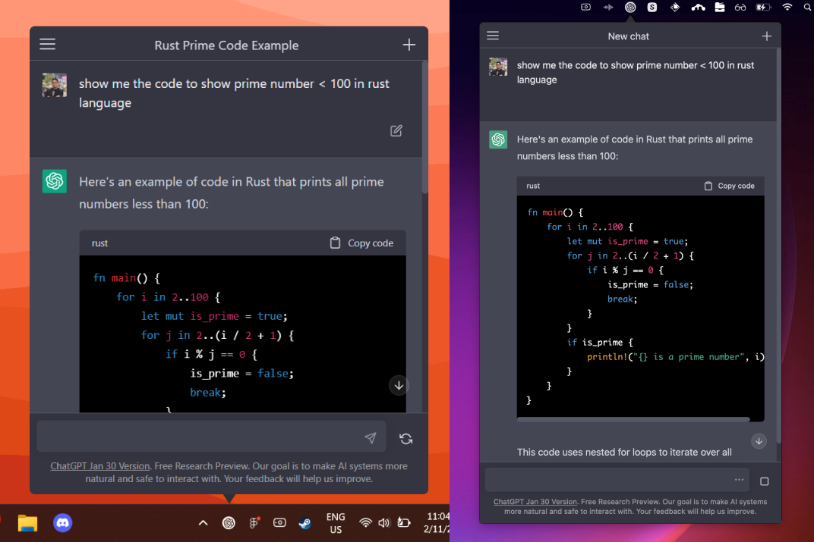

# Chat AI Desktop App

Unofficial open-source Chat AI desktop app for Mac, Windows, and Linux menubar using Tauri & Rust.

https://user-images.githubusercontent.com/856609/218365354-335ab01d-5d6f-4d97-af5f-a09e85f061b4.mp4



# Downloads

- [Windows](https://github.com/sonnylazuardi/chat-ai-desktop/releases/download/v0.5.0/chatgpt.msi) (4.11 MB)
- [MacOS](https://github.com/sonnylazuardi/chat-ai-desktop/releases/download/v0.5.0/chatgpt.dmg) (3.8 MB)
- [Linux .deb](https://github.com/sonnylazuardi/chatgpt-desktop/raw/master/releases/chatgpt_0.2.0_amd64.deb) (2.3 MB)
- [Linux .rpm](https://github.com/sonnylazuardi/chatgpt-desktop/raw/master/releases/chatgpt-0.2.0-2.x86_64.rpm) (2.1 MB)

## API Mode


I would like to credit [open source chatbot UI](https://github.com/mckaywrigley/chatbot-ui) by [@mckaywrigley](https://twitter.com/mckaywrigley) that made this possible. The desktop app wrapping the [forked version here](https://github.com/sonnylazuardi/chatbot-ui-pro)

### Set your API Key

You can visit [OpenAI Account](https://platform.openai.com/account/api-keys) to get your API key, click the menu on the top left and input your API Key


## FAQ

### Is it safe to login with my account in the app?

Yes, it is safe. No data is transferred in the app (you can check the source). It's just a wrapper for the popular Chat AI website. If you are unsure, you can build and use your own binary.

### I cannot open the MacOS app because the developer cannot be verified?


1. In the Finder on your Mac, locate the Chat AI app. Don't use Launchpad to do this. Launchpad doesn't allow you to access the shortcut menu.
2. Control-click the app icon, then choose Open from the shortcut menu.
3. Click Open.

https://support.apple.com/en-sg/guide/mac-help/mh40616/mac

## Recommended IDE Setup

- [VS Code](https://code.visualstudio.com/) + [Tauri](https://marketplace.visualstudio.com/items?itemName=tauri-apps.tauri-vscode) + [rust-analyzer](https://marketplace.visualstudio.com/items?itemName=rust-lang.rust-analyzer)

## Developing

```
yarn
yarn tauri dev
```

## Building

```
yarn
yarn tauri build
```
