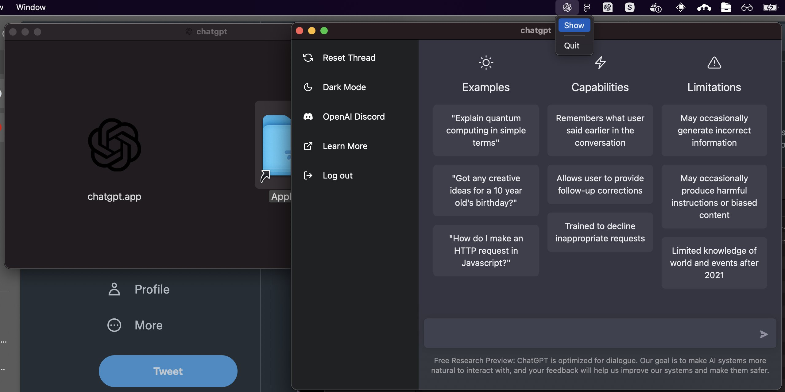

# ChatGPT Desktop App

Unofficial open source OpenAI ChatGPT desktop app for mac, windows, and linux menubar using tauri & rust.





# Downloads

- [Windows](https://github.com/sonnylazuardi/chatgpt-desktop/raw/master/releases/chatgpt.msi) (2.7 MB)
- [MacOS](https://github.com/sonnylazuardi/chatgpt-desktop/raw/master/releases/chatgpt.dmg) (2.1 MB)
- [Linux .deb](https://github.com/sonnylazuardi/chatgpt-desktop/raw/master/releases/chatgpt_0.2.0_amd64.deb) (2.3 MB)
- [Linux .rpm](https://github.com/sonnylazuardi/chatgpt-desktop/raw/master/releases/chatgpt-0.2.0-2.x86_64.rpm) (2.1 MB)

## FAQ

### Is it safe to login with my account in the app?

Yes, it is safe. There is no data transferred in the app (you can check the source). If you are still unsure, you can build your own binary and use it.

## Recommended IDE Setup

- [VS Code](https://code.visualstudio.com/) + [Tauri](https://marketplace.visualstudio.com/items?itemName=tauri-apps.tauri-vscode) + [rust-analyzer](https://marketplace.visualstudio.com/items?itemName=rust-lang.rust-analyzer)

## Developing

```
yarn tauri dev
```

## Building

```
yarn tauri build
```
