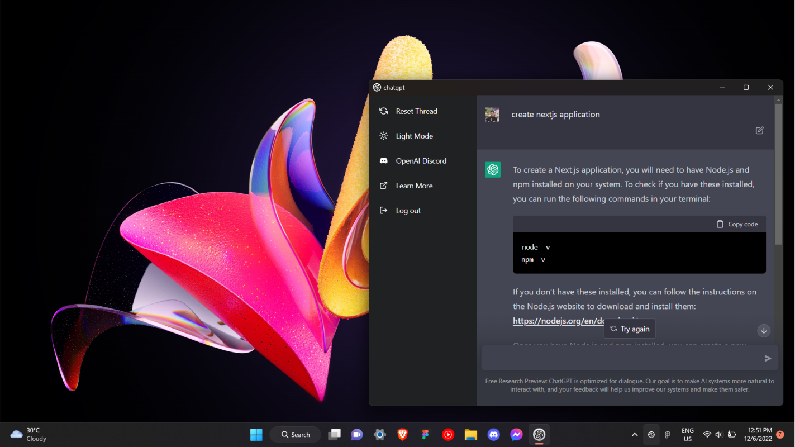
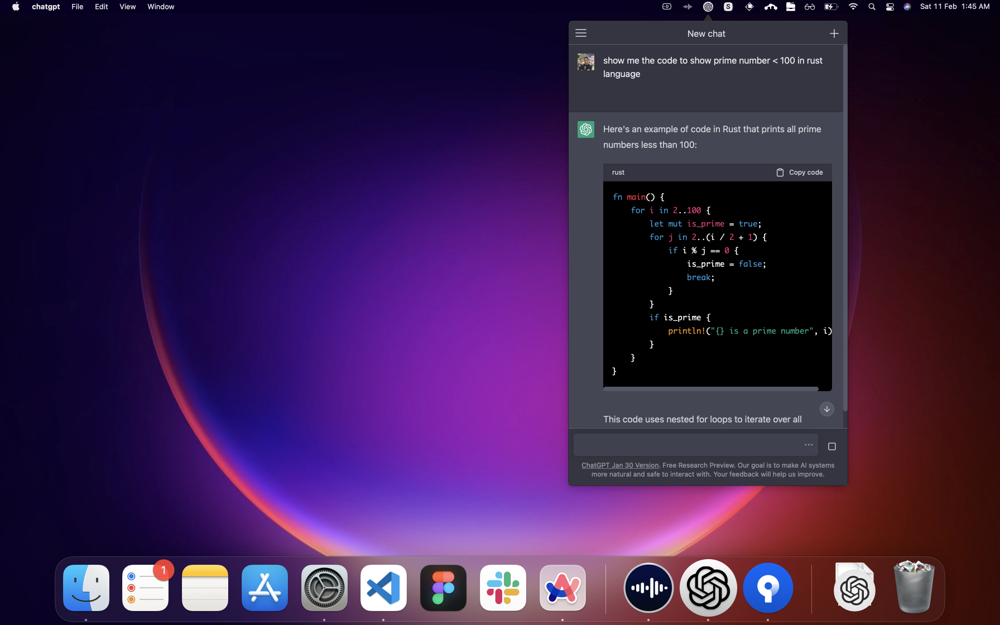
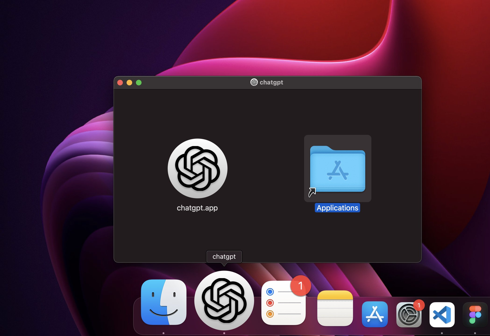

# ChatGPT Desktop App

Unofficial open source OpenAI ChatGPT desktop app for mac, windows, and linux menubar using tauri & rust.





# Downloads

- [Windows](https://github.com/sonnylazuardi/chatgpt-desktop/raw/master/releases/chatgpt.msi) (2.7 MB)
- [MacOS](https://github.com/sonnylazuardi/chatgpt-desktop/raw/master/releases/chatgpt.dmg) (2.1 MB)
- [Linux .deb](https://github.com/sonnylazuardi/chatgpt-desktop/raw/master/releases/chatgpt_0.2.0_amd64.deb) (2.3 MB)
- [Linux .rpm](https://github.com/sonnylazuardi/chatgpt-desktop/raw/master/releases/chatgpt-0.2.0-2.x86_64.rpm) (2.1 MB)

## FAQ

### Is it safe to login with my account in the app?

Yes, it is safe. There is no data transferred in the app (you can check the source). It's just a wrapper for OpenAI ChatGPT website. If you are still unsure, you can build your own binary and use it.

### I cannot open the MacOS app because developer cannot be verified?


1. In the Finder on your Mac, locate the chatgpt app. Don't use Launchpad to do this. Launchpad doesn't allow you to access the shortcut menu.
2. Control-click the app icon, then choose Open from the shortcut menu.
3. Click Open.

https://support.apple.com/en-sg/guide/mac-help/mh40616/mac

## Recommended IDE Setup

- [VS Code](https://code.visualstudio.com/) + [Tauri](https://marketplace.visualstudio.com/items?itemName=tauri-apps.tauri-vscode) + [rust-analyzer](https://marketplace.visualstudio.com/items?itemName=rust-lang.rust-analyzer)

## Developing

```
yarn
yarn tauri dev
```

## Building

```
yarn
yarn tauri build
```
